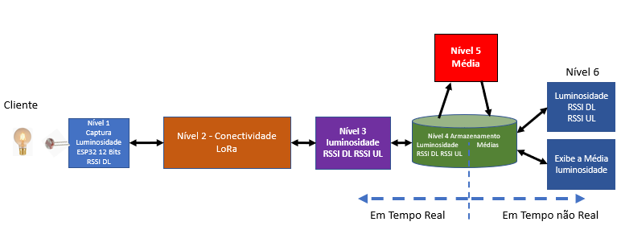
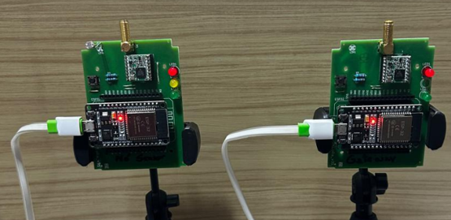

# DOCUMENTAÇÃO DO GUITHUB

## Introdução
Esse é um exemplo de como ducumentar um projeto e foi gerado pelo ChatGPT.

## Códigos
Códigos do nó sensor, gateway e Pythons.

## Figuras
Incluiu duas figuras do Framework e do Kit-LoRa

Figura 1 - Framework

Figura 2 - Kit-LoRa
